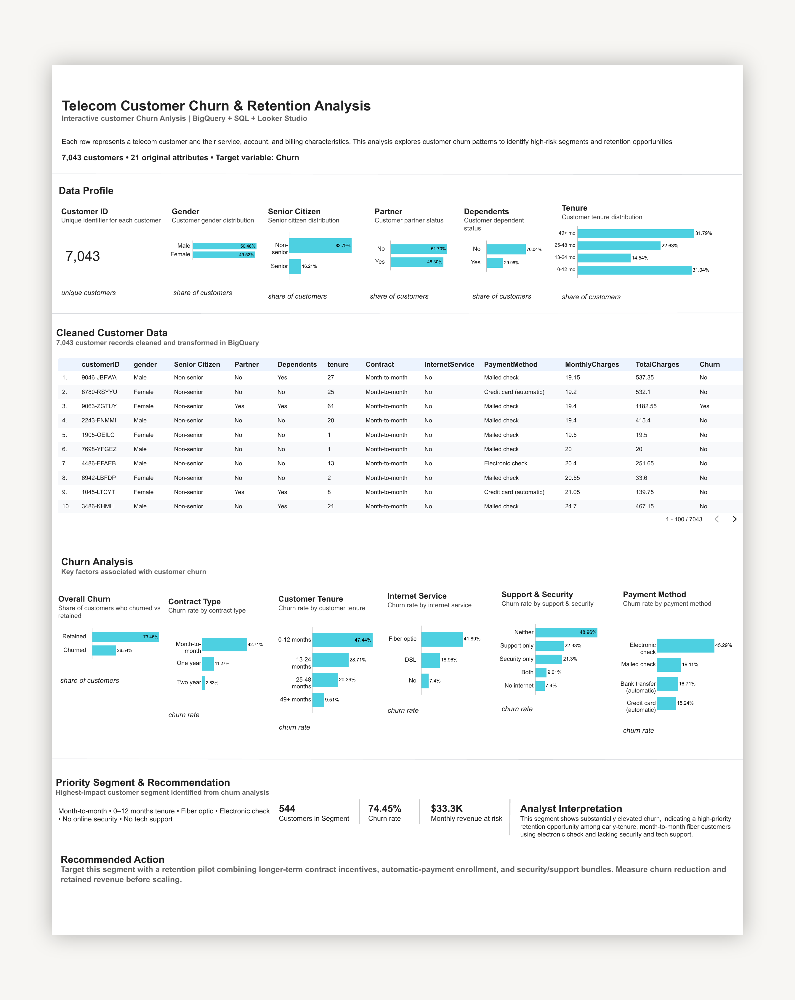

# Telecom Customer Churn & Retention Analysis

**Looker Studio · Google BigQuery · SQL**

## Project Overview

An end-to-end analysis of 7,043 telecom customer records to identify churn patterns, high-risk customer segments, and retention opportunities.

[View Live Analytical Report](https://datastudio.google.com/reporting/dd7514e4-a45a-4330-a7a8-9ad5bf956de5)

## Technical Implementation

This repository contains the SQL queries used for data cleaning, transformation, customer churn analysis, and high-risk segment identification in Google BigQuery.

